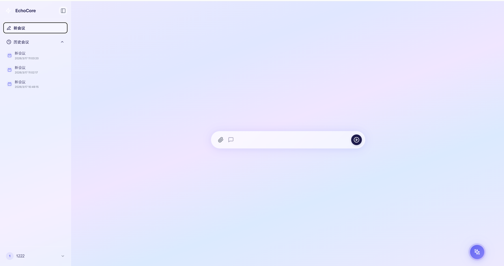
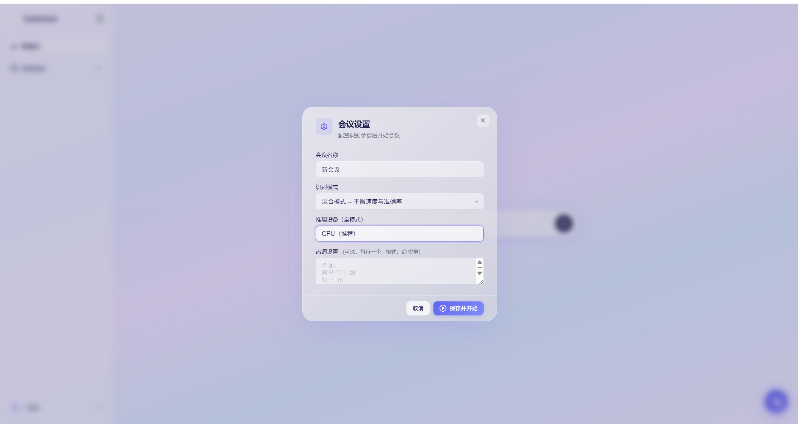
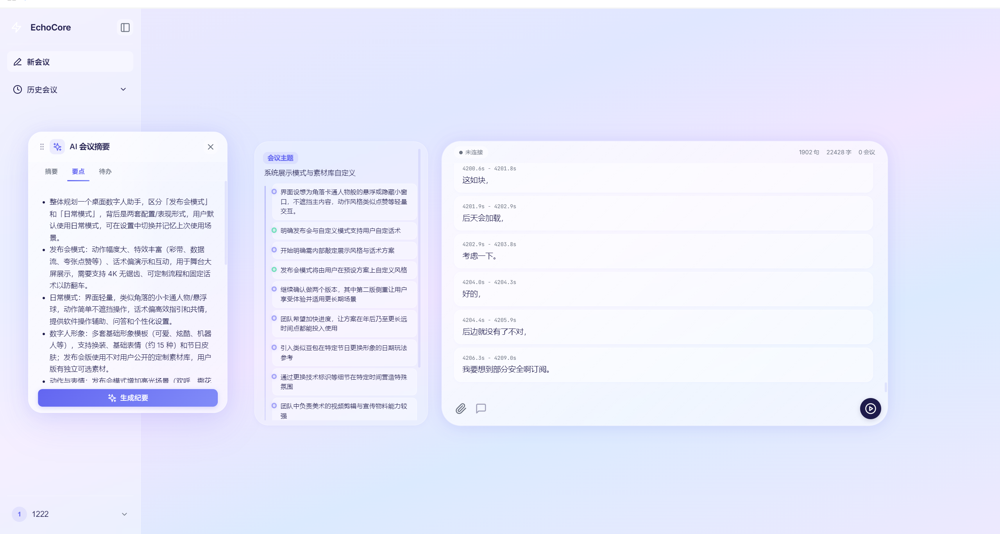
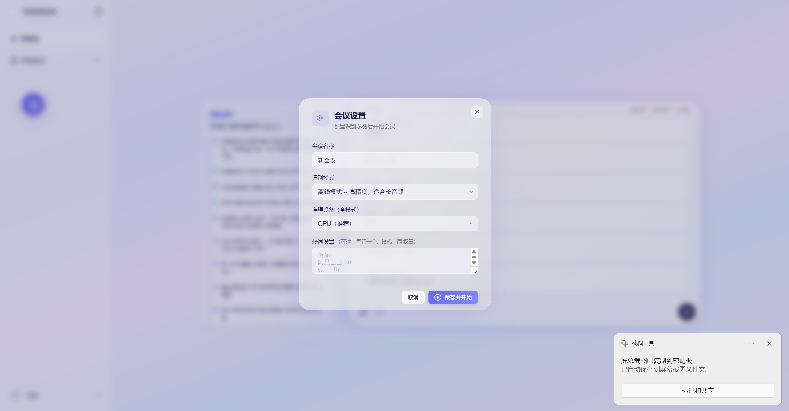

<div align="center">

# EchoCore

[](https://www.python.org/downloads/)
[](https://fastapi.tiangolo.com/)
[](LICENSE)
[](#)

*基于 FunASR 的智能会议助手，提供实时语音识别、AI 会议总结、离线转写和用户管理功能*

</div>

## 🎬 产品预览

<div align="center">
    
</div>

<table>
  <tr>
    <td width="33.33%" align="center">
      
      <br/>
      <sub>整体工作台视图</sub>
    </td>
    <td width="33.33%" align="center">
      
      <br/>
      <sub>实时转写与纪要联动</sub>
    </td>
    <td width="33.33%" align="center">
      
      <br/>
      <sub>历史会议与详情查看</sub>
    </td>
  </tr>
</table>

## 📋 目录

- [产品预览](#-产品预览)
- [功能特性](#-功能特性)
- [快速开始](#-快速开始)
- [Docker 部署](#-docker-部署)
- [使用指南](#-使用指南)
- [配置说明](#-配置说明)
- [API 文档](#-api-文档)
- [项目结构](#-项目结构)
- [常见问题](#-常见问题)
- [贡献指南](#-贡献指南)
- [许可证](#-许可证)

## ✨ 功能特性

| 模块 | 功能 | 描述 |
|------|------|------|
| 🎙️ **实时识别** | 三模式识别 | Online/Offline/2pass 混合模式，支持实时显示 |
| 📁 **离线转写** | 大文件处理 | 支持 1-2 小时音频，最大 2GB，自动分片上传 |
| 🤖 **AI 总结** | 纪要 + 时间线 | 手动生成会议纪要（摘要/要点/待办），流程时间线增量总结 |
| 👤 **用户系统** | 认证管理 | 登录/注册/JWT 认证，用户数据完全隔离 |
| 📊 **历史管理** | 会议管理 | 列表/详情/搜索功能，按用户隔离数据 |

### 核心特性

- **实时显示**: 2pass 模式下实时展示识别结果
- **智能纪要**: 一键生成摘要、要点、待办
- **流程时间线**: 基于增量识别内容提取会议关键节点
- **多格式支持**: MP3/WAV/M4A/AAC/FLAC 音频格式
- **热词优化**: 支持自定义热词提升特定词汇识别率
- **数据安全**: JWT 令牌认证，24 小时过期自动刷新

## 🚀 快速开始

### 前置要求

- Python 3.8+
- Linux/WSL 环境
- 4GB+ 内存（推荐 8GB）
- 10GB+ 磁盘空间（含模型文件）

### 1. 克隆与安装

```bash
# 克隆项目
git clone <your-repo-url>
cd EchoCore

# 安装 Python 依赖
pip install -r requirements.txt

# 推荐优先使用 Docker 镜像启动（见下方「Docker 部署」）
#
# 如需手动本地启动（非 Docker），请先自行编译 runtime：
# ./scripts/build_runtime.sh --gpu   # 或 --cpu
```

### 2. 模型配置

模型文件已包含在 `data/models/` 目录中。如需使用外部模型：

```bash
# 设置模型路径环境变量
export MODEL_DIR=/path/to/your/data/models
```

或在 `config/settings.yaml` 中配置：

```yaml
asr:
  model_dir: "path/to/your/data/models"
```

### 3. 启动服务（本地源码方式）

#### 方式一：使用启动脚本

```bash
cd scripts

# 启动所有服务（2pass 混合模式 + GPU，默认）
./start.sh start --2pass --gpu

# 或使用 CPU 模式（适用于无 GPU 环境）
./start.sh start --2pass --cpu

# 如需强制 2pass 的 ORT 也使用 GPU（可能更吃显存/更慢）
FUNASR_ORT_USE_CUDA=1 ./start.sh start --2pass --gpu

# 查看服务状态
./start.sh status

# 停止所有服务
./start.sh stop
```

#### 方式二：手动启动

```bash
# 终端 1: 启动 ASR 服务
./runtime/build/bin/funasr-wss-server-2pass \
  --download-model-dir ./data/models \
  --model-dir ./data/models/iic/speech_paraformer-large-vad-punc_asr_nat-zh-cn-16k-common-vocab8404-onnx \
  --online-model-dir ./data/models/iic/speech_paraformer-large_asr_nat-zh-cn-16k-common-vocab8404-online-onnx \
  --vad-dir ./data/models/iic/speech_fsmn_vad_zh-cn-16k-common-onnx \
  --punc-dir ./data/models/iic/punc_ct-transformer_zh-cn-common-vad_realtime-vocab272727-onnx \
  --decoder-thread-num 20 --model-thread-num 1 --io-thread-num 2 --port 10095

# 终端 2: 启动 Web 服务
cd backend
python main.py
```

### 4. 访问应用

打开浏览器访问：**http://localhost:8080**

> **注意**: 首次启动会加载模型，请确保网络连接稳定。

## 🐳 Docker 部署（推荐）

推荐直接使用已打包镜像启动：

```bash
# 1) 拉取镜像
docker pull crpi-mbgis9cix10urfs4.cn-hangzhou.personal.cr.aliyuncs.com/apollo_yh/echocore:v1

# 2) 启动容器
docker run -d \
  --name echocore \
  --restart unless-stopped \
  --gpus all \
  -p 8080:8080 \
  -p 10095:10095 \
  -e FUNASR_ORT_USE_CUDA=0 \
  -e MODELSCOPE_CACHE=/app/data/modelscope_cache \
  -e NVIDIA_VISIBLE_DEVICES=all \
  -e NVIDIA_DRIVER_CAPABILITIES=compute,utility \
  -v ./logs:/app/logs \
  -v ./data:/app/data \
  crpi-mbgis9cix10urfs4.cn-hangzhou.personal.cr.aliyuncs.com/apollo_yh/echocore:v1

# 3) 查看日志
docker logs -f echocore
```

默认行为：
- 使用 `2pass + GPU` 启动服务
- `FUNASR_ORT_USE_CUDA=0`（更接近官方实时模式，GPU占用更稳）

如果你要强制 2pass 的 ORT 也走 GPU（可能更吃显存/更慢）：

```bash
docker rm -f echocore
docker run -d \
  --name echocore \
  --restart unless-stopped \
  --gpus all \
  -p 8080:8080 \
  -p 10095:10095 \
  -e FUNASR_ORT_USE_CUDA=1 \
  -e MODELSCOPE_CACHE=/app/data/modelscope_cache \
  -e NVIDIA_VISIBLE_DEVICES=all \
  -e NVIDIA_DRIVER_CAPABILITIES=compute,utility \
  -v ./logs:/app/logs \
  -v ./data:/app/data \
  crpi-mbgis9cix10urfs4.cn-hangzhou.personal.cr.aliyuncs.com/apollo_yh/echocore:v1
```

如需本地构建镜像（开发调试）：

```bash
docker compose up -d --build
docker compose logs -f
```

## 📖 使用指南

### 实时会议转写

1. **注册/登录**: 首次使用需要注册账号
2. **创建会议**: 输入会议名称（可选）
3. **选择模式**:
   - 🌟 **混合模式（推荐）**: 平衡速度与准确率，实时显示结果
   - ⚡ **实时模式**: 快速响应，逐句返回
   - 🎯 **离线模式**: 高精度，适合复杂音频环境
4. **设置热词**（可选）: 输入专业术语、人名等提升识别率
5. **开始会议**: 点击"开始会议"按钮
6. **实时查看**: 语音识别结果实时显示
7. **生成纪要**: 会后点击“生成纪要”，输出摘要/要点/待办

### 流程时间线（增量）

- 会议进行中会按识别内容增量提炼关键节点
- 用于展示会议进展、转折点和阶段性结论
- 与右侧会议纪要面板解耦，纪要仍由用户手动触发生成

### 离线音频转写

适用于长音频文件（1-2 小时）:

1. 切换到"离线模式"标签
2. **上传文件**: 拖拽或点击选择音频
3. **查看进度**: 上传进度 + 识别进度双栏显示
4. **获取结果**: 识别完成后自动显示完整转写

> **技术细节**: 支持最大 2GB 文件，使用 8MB 分片并发上传

## ⚙️ 配置说明

### 配置文件

编辑 `config/settings.yaml`:

```yaml
# Web 服务配置
web:
  host: "0.0.0.0"
  port: 8080

# ASR 服务配置
asr:
  host: "127.0.0.1"
  port: 10095

# LLM 服务配置
llm:
  provider: "ollama"      # 可选: ollama | openai | claude
  api_base: "http://localhost:11434"
  model: "qwen2.5:7b"
  # api_key: ""           # OpenAI/Claude 需要

# 认证配置
auth:
  secret_key: "your-secret-key-change-in-production"
```

### 模型路径配置

```yaml
asr:
  model_dir: "./data/models"    # 本地模型目录
  # 或使用绝对路径
  # model_dir: "/home/user/EchoCore/data/models"
```

### LLM 服务配置

#### Ollama（本地部署，推荐）

```bash
# 安装 Ollama
curl -fsSL https://ollama.ai/install.sh | sh

# 启动服务
ollama serve

# 下载模型（至少 7B 参数）
ollama pull qwen2.5:7b
```

#### OpenAI API

```yaml
llm:
  provider: "openai"
  api_base: "https://api.openai.com/v1"
  model: "gpt-4"
  api_key: "sk-xxx"
```

#### Claude API

```yaml
llm:
  provider: "claude"
  api_base: "https://api.anthropic.com/v1"
  model: "claude-sonnet-4-20250514"
  api_key: "sk-ant-api03-xxx"
```

## 📚 API 文档

### 认证接口

| 方法 | 路径 | 说明 | 请求体 |
|------|------|------|--------|
| POST | `/api/auth/login` | 用户登录 | `{username, password}` |
| POST | `/api/auth/register` | 用户注册 | `{username, password, email?}` |
| GET | `/api/auth/me` | 获取当前用户 | Headers: `Authorization: Bearer <token>` |
| POST | `/api/auth/refresh` | 刷新令牌 | Headers: `Authorization: Bearer <token>` |

**登录响应示例**:
```json
{
  "access_token": "eyJhbGciOiJIUzI1NiIs...",
  "token_type": "bearer",
  "user": {
    "id": "uuid",
    "username": "username",
    "email": "email@example.com"
  }
}
```

### 会议接口

| 方法 | 路径 | 说明 |
|------|------|------|
| POST | `/api/meetings` | 创建会议（需登录） |
| GET | `/api/meetings` | 获取会议列表 |
| GET | `/api/meetings/{id}` | 获取会议详情 |
| POST | `/api/meetings/{id}/end` | 结束会议 |
| DELETE | `/api/meetings/{id}` | 删除会议 |
| GET | `/api/meetings/{id}/transcript` | 获取转写内容 |
| GET | `/api/meetings/{id}/summary` | 获取会议总结 |
| GET | `/api/meetings/search?q=关键词` | 搜索会议 |

**创建会议请求**:
```json
{
  "name": "项目周会",
  "mode": "2pass",
  "hotwords": {
    "项目名称": 2,
    "术语": 1
  }
}
```

### 离线上传接口

| 方法 | 路径 | 说明 |
|------|------|------|
| POST | `/api/offline/uploads/init` | 初始化上传会话 |
| PUT | `/api/offline/uploads/{id}/chunks/{index}` | 上传分片 |
| POST | `/api/offline/uploads/{id}/complete` | 完成上传 |
| GET | `/api/offline/jobs/{id}` | 获取任务状态 |
| POST | `/api/offline/jobs/{id}/cancel` | 取消任务 |

**上传流程**:
```
1. POST /uploads/init          → 获取 upload_id
2. PUT /uploads/{id}/chunks/0 → 上传第 1 个分片
3. PUT /uploads/{id}/chunks/1 → 上传第 2 个分片
...
4. POST /uploads/{id}/complete → 合并文件，开始识别
5. GET /jobs/{id}             → 轮询状态
```

### 流程时间线增量接口

| 方法 | 路径 | 说明 |
|------|------|------|
| POST | `/api/realtime/summary` | 生成流程时间线增量总结（供左侧流程时间线） |
| GET | `/api/realtime/status` | 服务状态检查 |

> 说明：该接口用于会议进行中“流程时间线”增量提炼，不用于右侧会议纪要面板。
> 右侧会议纪要（摘要/要点/待办）由前端点击“生成纪要”后调用 `/api/llm/summarize` 生成。

**增量总结请求**:
```json
{
  "text": "会议讨论内容...",
  "previous_summary": "之前的摘要..."
}
```

## 📂 项目结构

```
EchoCore/
├── backend/                    # FastAPI 后端服务
│   ├── main.py                # 应用入口
│   ├── config.py              # 配置管理
│   ├── routes/                # API 路由
│   │   ├── auth.py           # 认证接口
│   │   ├── meetings.py       # 会议管理
│   │   ├── offline.py        # 离线上传
│   │   ├── realtime.py       # 实时总结
│   │   └── llm.py           # LLM 集成
│   ├── services/              # 业务逻辑
│   │   ├── auth_service.py   # JWT 认证服务
│   │   ├── llm_service.py   # LLM 调用封装
│   │   └── meeting_service.py # 会议数据服务
│   └── models/                # 数据模型
│       └── user.py           # 用户模型
├── frontend/                   # 前端资源
│   ├── index.html             # 主页面
│   ├── css/
│   │   └── main.css          # 样式文件
│   └── js/
│       └── app.js            # 主逻辑
├── scripts/                   # 启动脚本
│   ├── start.sh              # 服务管理脚本
│   ├── build_runtime.sh      # runtime 一键编译脚本
│   └── install.sh            # 安装脚本
├── onnxruntime/               # runtime 编译源码（项目内自维护）
├── config/                    # 配置文件
│   └── settings.yaml         # 应用配置
├── data/                      # 数据存储
│   ├── models/              # ASR 模型文件
│   │   ├── iic/             # FunASR 模型
│   │   │   ├── speech_paraformer-*/
│   │   │   ├── speech_fsmn_vad_*/
│   │   │   └── punc_*/
│   │   └── ...              # 其他模型
│   ├── users/               # 用户数据
│   └── meetings/            # 会议数据
├── logs/                      # 日志文件
│   ├── asr.log
│   └── web.log
├── runtime/                   # ASR 运行时
│   ├── build/bin/            # 已编译可执行文件
│   │   ├── funasr-wss-server
│   │   └── funasr-wss-server-2pass
│   ├── readme_zh.md          # 编译说明
│   ├── CMakeLists.txt        # 构建配置
│   ├── onnxruntime-linux-x64-1.14.0/
│   └── ffmpeg-master-latest-linux64-gpl-shared/
├── requirements.txt          # Python 依赖
├── Dockerfile                # 容器镜像构建
├── docker-compose.yml        # 容器编排
└── README.md                 # 本文档
```

## ❓ 常见问题

### Q: 实时显示不工作？

确保使用 `--2pass` 参数启动 ASR 服务：
```bash
./scripts/start.sh restart --2pass --gpu
```

### Q: 离线识别很慢？

- 首次运行需要加载模型
- 1 小时音频约需 10-20 分钟
- 使用 GPU 可显著加速

### Q: 用户数据如何隔离？

- 每个会议关联 `user_id` 字段
- 未登录用户无法创建会议
- 登录后仅显示当前用户的会议
- 数据存储在 `data/users/` 和 `data/meetings/`

### Q: 如何查看日志？

```bash
# Web 服务日志
tail -f logs/web.log

# ASR 服务日志
tail -f logs/asr.log
```

### Q: 如何清除所有数据？

```bash
rm -rf data/*
```

### Q: LLM 服务不可用？

1. 检查 LLM 服务是否运行
2. 验证 `settings.yaml` 配置正确
3. 查看 `llm_service.py` 日志

### Q: 支持说话人分离吗？

当前版本已移除说话人 ID 展示链路，默认不输出说话人分离结果。

## 🤝 贡献指南

欢迎贡献代码！请遵循以下步骤：

1. Fork 本仓库
2. 创建分支：`git checkout -b feature/xxx`
3. 提交更改：`git commit -m 'Add feature xxx'`
4. 推送分支：`git push origin feature/xxx`
5. 创建 Pull Request

### 开发规范

- Python 代码遵循 PEP 8
- 使用类型注解（Type Hints）
- 异步代码使用 `async/await`
- 提交前运行 `python -m py_compile` 检查语法

## 📄 许可证

本项目基于 MIT 许可证开源。

## 🙏 致谢

- [FunASR](https://github.com/alibaba-damo-academy/FunASR) - 阿里巴巴语音识别框架
- [FastAPI](https://fastapi.tiangolo.com/) - 现代 Python Web 框架
- [Ollama](https://ollama.ai/) - 本地 LLM 运行时

---

<div align="center">

**EchoCore** - 让会议记录更智能

</div>
